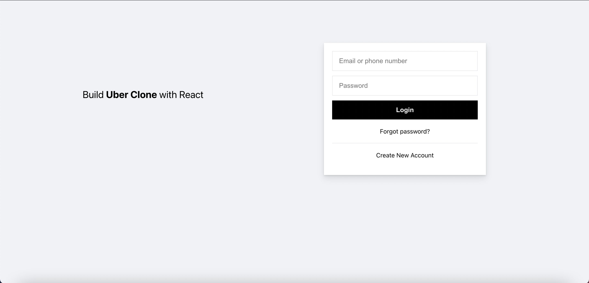
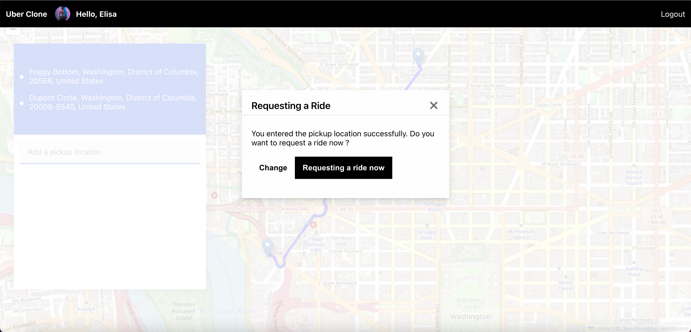
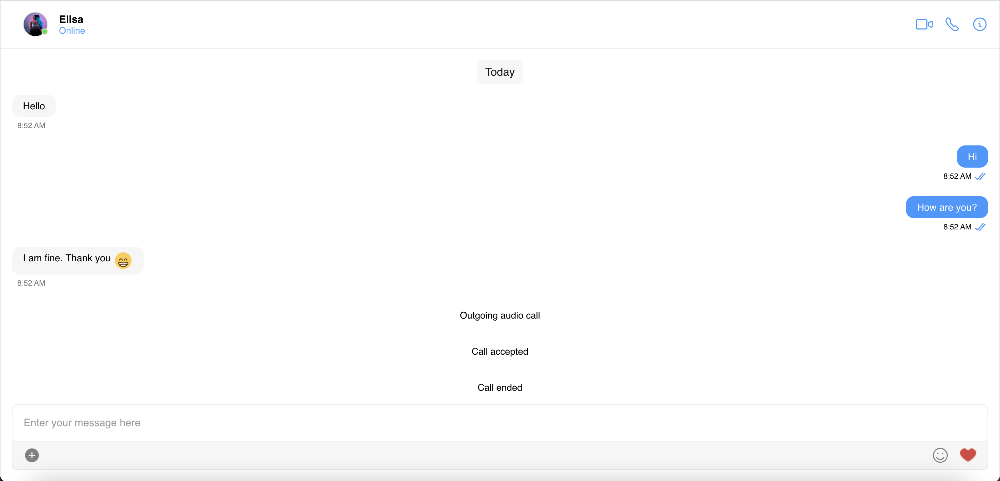

# How to Build Uber Clone with React








## Table of Contents

| No. | Topics                                    |
| --- | ----------------------------------------- |
| 1   | [About Code Courses](#about-code-courses) |
| 2   | [Live Demo](#live-demo)                   |
| 3   | [Technologies](#technologies)             |
| 4   | [Running the demo](#running-the-demo)     |
| 5   | [Useful links](#useful-links)             |

<a id="about-code-courses"></a>

## 1. About Code Courses

<a href="https://codecourses.site">Code Courses</a> is a website where people learn about coding and different technologies/frameworks/libraries. To help people learn, all of the courses are **FREE** and **DETAIL**. Hopefully, after following the content on Code Courses, you will find your dream jobs, and build any applications that you want.

<a id="live-demo"></a>

## 2. Live Demo

- For the full course, You can refer to this [link](https://codecourses.site/react/how-to-build-uber-clone-with-react-ep-1/).

- You can refer to this [Youtube video](https://www.youtube.com/watch?v=zbL1hofCBJo) for the live demo.

<a id="technologies"></a>

## 3. Technologies

This demo uses:

- CometChat Pro 3.0.0
- CometChat UI Kit
- Firebase
- React.js
- Uuid
- Validator
- @emotion/core
- dateformat
- emoji-mart
- html-react-parser
- twemoji
- leaflet-geosearch
- leaflet-routing-machine
- leaflet

<a id="running-the-demo"></a>

## 4. Running the demo

To run the demo follow these steps:

1. [Head to CometChat Pro and create an account](https://app.cometchat.com/signup)
2. From the [dashboard](https://app.cometchat.com/apps), add a new app called **"uber-clone"**
3. Select this newly added app from the list.
4. From the Quick Start copy the **APP_ID, APP_REGION and AUTH_KEY**. These will be used later.
5. Also copy the **REST_API_KEY** from the API & Auth Key tab.
6. Navigate to the Users tab, and delete all the default users and groups leaving it clean **(very important)**.
7. Download the repository [here](https://github.com/codecourses-site/uber-clone/archive/main.zip) or by running `git clone https://github.com/codecourses-site/uber-clone.git` and open it in a code editor.
8. [Head to Firebase and create a new project](https://console.firebase.google.com)
9. Create a file called **.env** in the root folder of your project.
10. Import and inject your secret keys in the **.env** file containing your CometChat and Firebase in this manner.

```js
REACT_APP_FIREBASE_API_KEY = xxx - xxx - xxx - xxx - xxx - xxx - xxx - xxx
REACT_APP_FIREBASE_AUTH_DOMAIN = xxx - xxx - xxx - xxx - xxx - xxx - xxx - xxx
REACT_APP_FIREBASE_DATABASE_URL = xxx - xxx - xxx - xxx - xxx - xxx - xxx - xxx
REACT_APP_FIREBASE_STORAGE_BUCKET =
  xxx - xxx - xxx - xxx - xxx - xxx - xxx - xxx

REACT_APP_COMETCHAT_APP_ID = xxx - xxx - xxx - xxx - xxx - xxx - xxx - xxx
REACT_APP_COMETCHAT_REGION = xxx - xxx - xxx - xxx - xxx - xxx - xxx - xxx
REACT_APP_COMETCHAT_AUTH_KEY = xxx - xxx - xxx - xxx - xxx - xxx - xxx - xxx
REACT_APP_COMETCHAT_API_KEY = xxx - xxx - xxx - xxx - xxx - xxx - xxx - xxx

REACT_APP_MAP_BOX_API_KEY = xxx - xxx - xxx - xxx - xxx - xxx - xxx - xxx
```

11. Make sure to exclude **.env** in your gitIgnore file from being exposed online.
12. Run the following command to install the app.

```sh
    npm install
    npm run start
```

Questions about running the demo? [Open an issue](https://github.com/codecourses-site/uber-clone/issues). We're here to help ✌️

<a id="useful-links"></a>

## 5. Useful links

- 🔥 [Firebase](https://console.firebase.google.com)
- 🔷 [React.js](https://reactjs.org/)
